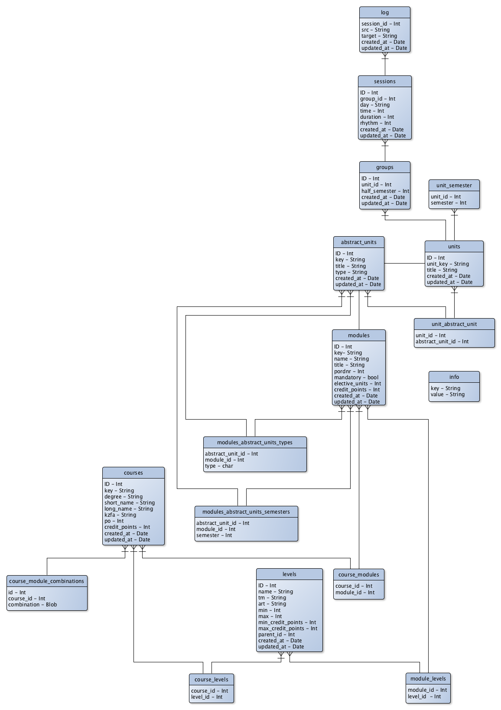

# PlüS Data

This repository is part of the [PlüS Project](https://github.com/plues) and
contains the tools to generate sqlite3 databases and .mch files from raw timetable
input data as provided by the faculties of Humanities and Economics at [Heinrich-Heine University Düsseldorf](http://hhu.de).

This repository contains sample data for each faculty in `raw/[faculty name]/`.

## Documentation

See [Documentation](docs.md) for a description of the data format.

## Generating data

To generate the sql data representations or an already seeded SQLite database
use the provided makefile targets.

Call `make data.sqlite3` or `make data.mch` to generate either a database or a
B-machine (.mch). Add `flavor=[variant]` to override the default variant (the default is `philfak`), e.g:

```
make data.sqlite3 flavor=wiwi
```

## Schema

The schema of the generated databases is described in this picture:



## Dependencies

* sqlite3
* JVM

This project depends on the following tools, that are part of the [PlÜS project](http://tuatara.cs.uni-duesseldorf.de/groups/slottool).

* [model-generator](https://github.com/plues/model-generator)
* [mincer](https://github.com/plues/mincer)

## LICENSE

### Timetabling Data

All timetabling data as provided in the `raw/` directory is available unter the terms of the [Creative Commons Attribution-NonCommercial-ShareAlike 4.0 International Public License](http://creativecommons.org/licenses/by-nc-sa/4.0/legalcode).

[](http://creativecommons.org/licenses/by-nc-sa/4.0/)

### Source code

The source code distributed in this repository to process and transform the raw data is distributed under the terms of the [ISC License](LICENSE).
